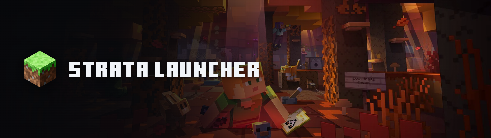

<p align="center">
  
</p>

[](LICENSE)
[](https://github.com/nihalantiir/stratalauncher/releases)
[](https://github.com/nihalantiir/stratalauncher/actions/workflows/ci.yml)
[](#development)
[](#stack)
[](#stack)

A Minecraft launcher. Vanilla, Fabric, Forge, NeoForge, and Quilt, with
one-click modpack import from Modrinth and CurseForge. Portable, no
install required, no account beyond your own Microsoft sign-in.

Not affiliated with Mojang or Microsoft. Minecraft is a trademark of
Mojang Synergies AB. Strata uses only official Mojang/Minecraft assets
(fonts, panoramas, version data) under their own published licenses,
direct API access, or fair nominative use, listed in
[`public/loaders/NOTICE.md`](public/loaders/NOTICE.md) and
[`public/branding/NOTICE.md`](public/branding/NOTICE.md).

**Contents:** [Download](#download) · [Development](#development) ·
[Stack](#stack) · [Data location](#data-location) ·
[Project layout](#project-layout) · [License](#license)

## Download

Grab the latest build from [Releases](https://github.com/nihalantiir/stratalauncher/releases).
Unzip anywhere and run `strata.exe`. Updates apply in place without
touching your instances, worlds, or settings.

## Development

1. Install **Rust** (stable) and **Node.js**.
2. Install a **JDK/JRE** matching the Minecraft version you want to run;
   Strata doesn't manage its own yet. Make sure `java` is on `PATH` or
   `JAVA_HOME` is set.
3. Set up your own Microsoft OAuth app for sign-in (Mojang/Xbox auth is
   per-application, not shared):
   - portal.azure.com -> App registrations -> New registration
   - Supported account types: "Personal Microsoft accounts only"
   - Authentication -> Advanced settings -> "Allow public client flows": Yes
   - Authentication -> Add a platform -> "Mobile and desktop applications" ->
     add `https://login.microsoftonline.com/common/oauth2/nativeclient`
   - Submit the Client ID at https://aka.ms/mce-reviewappid and wait for
     approval before Xbox sign-in will work (a few days, one time)
   - Set the Client ID before running Strata:
     ```
     $env:STRATA_MS_CLIENT_ID = "your-client-id-here"   # PowerShell
     export STRATA_MS_CLIENT_ID=your-client-id-here      # bash
     ```
   - Offline mode needs none of this.
4. Run it:
   ```
   npm install
   npm run tauri dev
   ```

**Release builds:** copy `src-tauri/secrets.release.env.example` to
`src-tauri/secrets.release.env`, fill in real keys, and `build.rs` bakes
them into the binary at compile time. Never committed; a build without
this file still compiles fine, just without those credentials.

## Stack

Tauri 2 (Rust) for the shell and backend, Vue 3 for the UI, SQLite for
local data.

## Data location

Portable-first: a `data/` folder next to the executable holds the
database, downloaded libraries/assets/versions, and instances. Falls
back to the OS per-user app-data directory if that location isn't
writable. Microsoft refresh tokens live in the OS keychain, never on disk.

## Project layout

- `src-tauri/src/auth/`: Microsoft device-code flow, Xbox Live/XSTS,
  Minecraft Services auth, OS keychain access, offline-profile UUIDs.
- `src-tauri/src/minecraft/`: version manifest, checksum-verified
  downloads, argument-rule evaluation, process launch.
- `src-tauri/src/modpack/`: Modrinth/CurseForge modpack import.
- `src-tauri/src/db/`: SQLite connection, migrations, accounts repo.
- `src-tauri/src/commands/`: the Tauri command surface the frontend calls.
- `src/`: Vue 3 app: `stores/` (Pinia), `views/`, `components/`,
  `i18n/` (en/es/fr/pl), `api/` (typed `invoke` wrappers).

## License

GPL-3.0. See [LICENSE](LICENSE). You can read the code, build it, and
run it freely; a modified or redistributed version must stay open under
the same license, not be relicensed or folded into a closed product.
